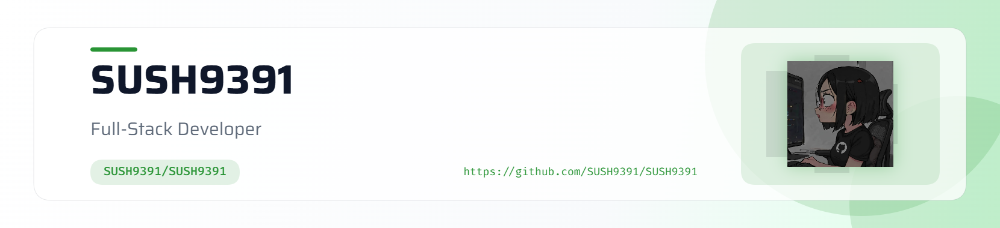

 <picture>
   <source media="(prefers-color-scheme: dark)" srcset="art/header-dark.png">
   
</picture>

<h1 align="center">
  Hey there, I'm Sushmitha
</h1>

  
  
  

<h2 align="center">👩‍💻 About Me</h2>

<table align="center">
<tr>

<td width="65%" valign="top">

- 💻 Working with **Generative AI, RAG & Agentic AI**.
- 🌱 Continuously learning, experimenting and shipping.
- 🚀 Enjoy turning complex ideas into practical products.
- 🎯 Building with **Python, React & TypeScript**.
- 🎨 Creating interactive interfaces with **Three.js & GSAP**
- 🌌 Exploring **LLMs, Transformers & AI Systems**
- ✨ Always chasing the next idea worth building.
- 📍 Based in **Bengaluru, India**
</td>

<td width="35%" align="center" valign="middle">

</td>

</tr>
</table>

<h2 align="center">💻 Tech Stack</h2>

<h2 align="center">📈 GitHub Analytics</h2>

<h2 align="center">🐍 Contribution Snake</h2>

  

<!--
To enable the snake animation:

1. Create a GitHub Action in this repository.
2. Use Platane/snk to generate the SVG every day.
3. Commit the generated file into:
   output/github-contribution-grid-snake.svg
-->

<h2 align="center">🌐 Let's Connect</h2>

See you in the next commit 🌸

</p<!-- ═══════════════════════════════════════════════════════
     CONTRIBUTION SNAKE
════════════════════════════════════════════════════════ -->

 

>
